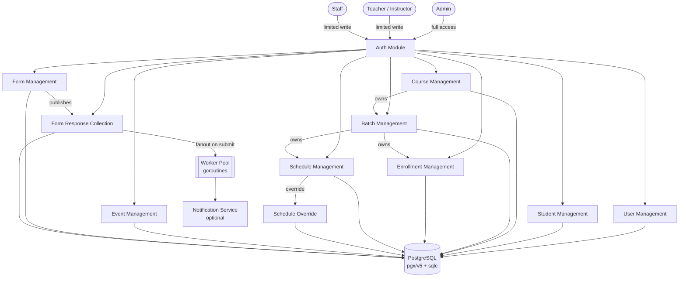
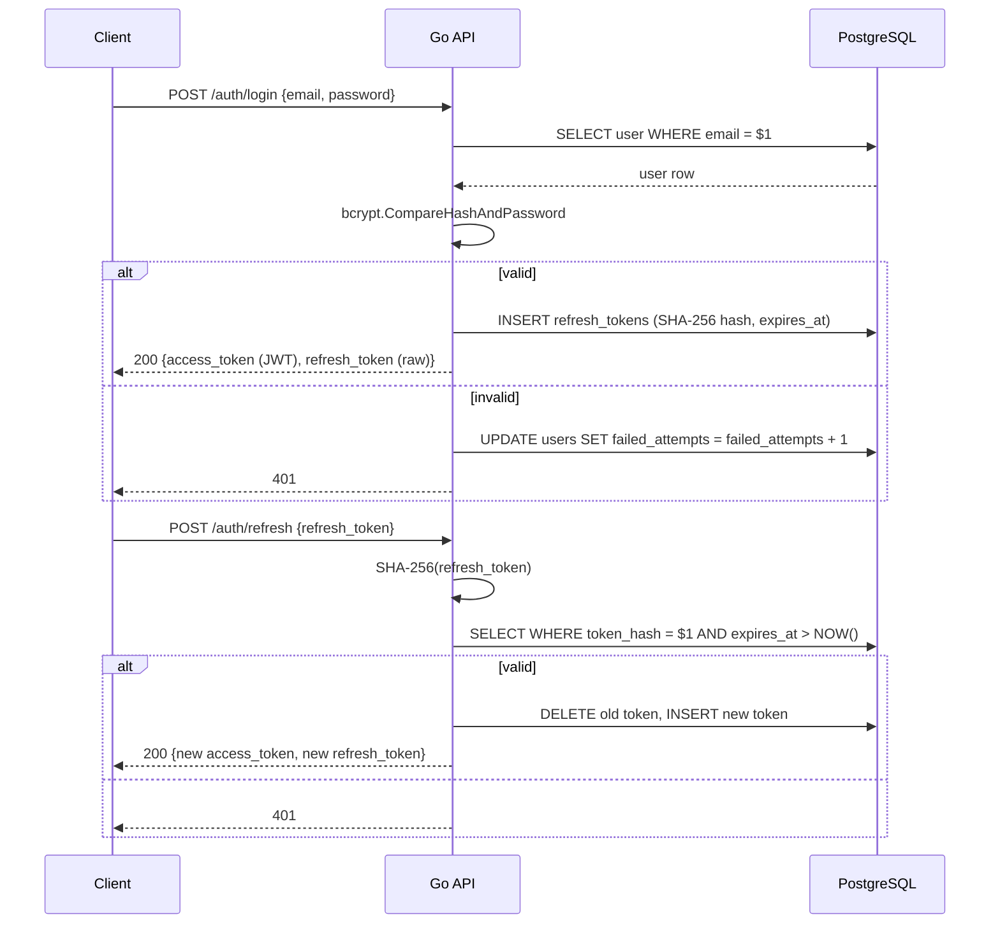
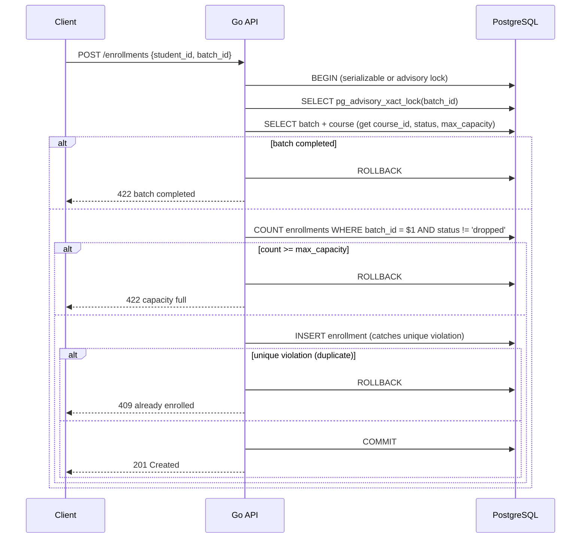
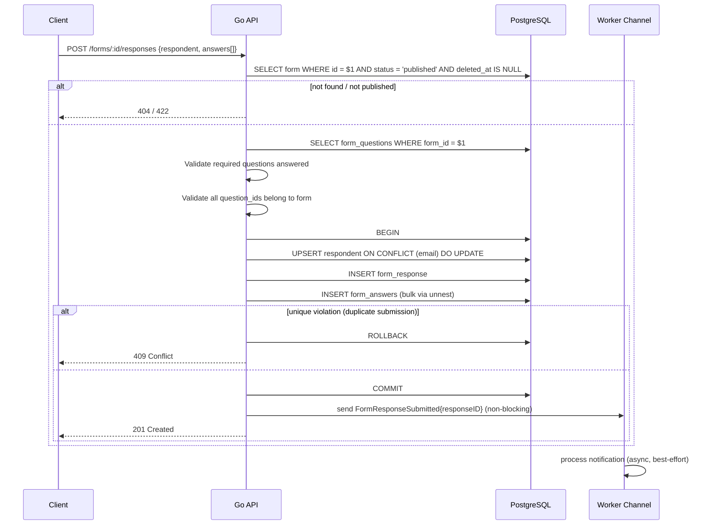
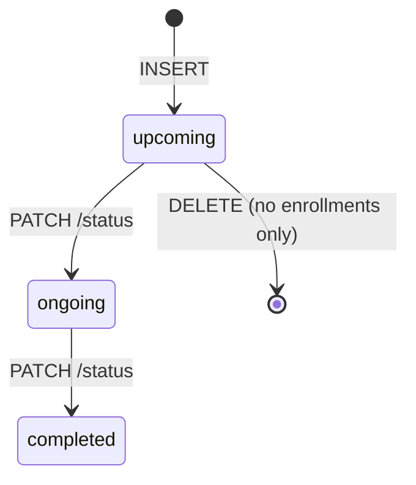
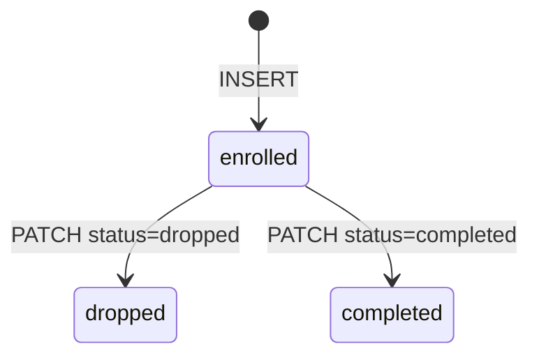
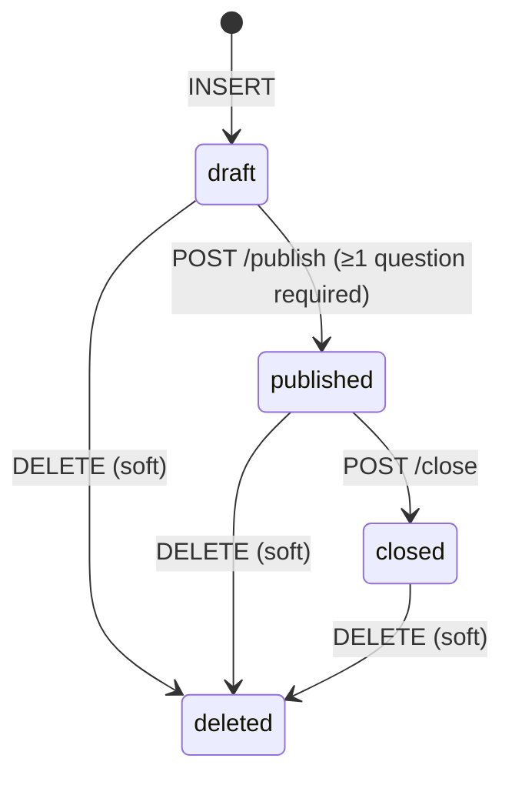

# Functional Requirement Document

## Teman Berbahasa - Tutor Place Management System

**Version:** 1.0
**Audience:** Backend Engineers, Solution Architects  
**Context:** Internal management system for a tutoring center (Indonesian SME). Web-based, staff/teacher-facing. No student-facing portal assumed.

---

## Executive Summary

A **modular monolith** Go backend managing the full operational lifecycle of a tutoring center: student registration, course/batch management, scheduling (with instructor overrides), enrollment, calendar events, and a dynamic form builder with response collection.

**Core architecture:**

- Go HTTP server (standard `net/http` + router, or lightweight framework)
- PostgreSQL — single instance, no ORM; raw SQL via `sqlc` for type-safe generated queries
- `pgx/v5` as PostgreSQL driver
- `golang-migrate` for schema migrations
- JWT authentication — access token in memory, refresh token in DB
- Role-based access control: `admin`, `teacher`, `staff`
- Async jobs via goroutine worker pool with DB-backed queue (no Redis required in v1)
- Single binary deployment — no runtime dependencies on server

---

## Functional Requirement Diagram



---

## Modules

### 1. Auth

**Purpose:** Authenticate system users. Issue and invalidate JWT tokens.

**Responsibilities:**

- Login with email + password
- Issue short-lived access JWT + long-lived refresh token (stored in `refresh_tokens` table)
- Token refresh via refresh token
- Logout — delete refresh token row
- Password reset flow (request → email link → confirm)

**Owned data:** `users` (auth fields), `refresh_tokens`

**Endpoints:**

- `POST /auth/login`
- `POST /auth/logout`
- `POST /auth/refresh`
- `POST /auth/password-reset/request`
- `POST /auth/password-reset/confirm`

**Go implementation notes:**

- Password hashing: `golang.org/x/crypto/bcrypt`, cost 12
- JWT: `github.com/golang-jwt/jwt/v5` — sign with `RS256` (prefer over HS256; private key from env/file)
- Access token TTL: 15 min. Refresh token TTL: 7 days, stored as `SHA-256(token)` in DB (never raw)
- Rate-limit login: in-memory counter per IP using `sync.Map` + TTL, or `golang.org/x/time/rate` per IP
- Account lock: increment `failed_attempts` on `users`; lock after 10; reset on successful login

**Middleware pattern:**

```go
// Auth middleware extracts and validates JWT, injects claims into context
func AuthMiddleware(next http.Handler) http.Handler
func RequireRole(roles ...string) func(http.Handler) http.Handler
```

---

### 2. User Management

**Purpose:** CRUD for internal system users (admin, teacher, staff).

**Responsibilities:**

- Create/update/deactivate users
- Assign roles
- List users filterable by role/status

**Owned data:** `users`

**Endpoints:**

- `GET /users` — filter by `role`, `status`; paginated
- `POST /users`
- `GET /users/:id`
- `PATCH /users/:id`
- `DELETE /users/:id` — soft deactivate (`status = inactive`), never hard delete

**Security:** Admin-only for create/deactivate. Any authenticated user can `GET /users/:id` for their own record only; admin can access any.

---

### 3. Student Management

**Purpose:** CRUD for student records.

**Responsibilities:**

- Register students
- Update student profile and status
- Search/filter students (name, email, status)

**Owned data:** `students`

**Endpoints:**

- `GET /students` — paginated; filterable by `status`; search by `name` / `email`
- `POST /students`
- `GET /students/:id`
- `PATCH /students/:id`
- `DELETE /students/:id` — soft deactivate only

**Security:** Admin and staff can write. Teachers read-only.

**Go implementation notes:**

- Full-text search: use `to_tsvector` / `plainto_tsquery` on `(first_name || ' ' || last_name || ' ' || email)` column — add GIN index. For simple LIKE: `WHERE first_name ILIKE $1 OR last_name ILIKE $1 OR email ILIKE $1` is acceptable at this scale.
- Pagination: offset-based; pass `limit` + `offset` as sqlc query params.

---

### 4. Course Management

**Purpose:** Define and maintain course catalog.

**Responsibilities:**

- CRUD for courses
- Archive courses (guard: no active batches)

**Owned data:** `courses`

**Endpoints:**

- `GET /courses`
- `POST /courses`
- `GET /courses/:id`
- `PATCH /courses/:id`
- `PATCH /courses/:id/archive`

**Business rules:**

- Cannot archive a course with `ongoing` batches — query count before update
- `course_code` globally unique — DB unique constraint + catch `pgerrcode.UniqueViolation`

---

### 5. Batch Management

**Purpose:** Manage batches scoped to a course. Assign default instructor. Transition status.

**Responsibilities:**

- CRUD for batches
- Assign/reassign default instructor
- Explicit status transitions
- List batches by course, status, academic year

**Owned data:** `batches`

**Endpoints:**

- `GET /batches` — filter by `course_id`, `status`, `academic_year`; paginated
- `POST /batches`
- `GET /batches/:id`
- `PATCH /batches/:id`
- `PATCH /batches/:id/status`

**Business rules:**

- `(course_id, batch_code)` unique — DB constraint + catch `pgerrcode.UniqueViolation`
- `instructor_user_id` must reference `users.role = teacher` — validate in service layer before insert
- Cannot delete a batch with active enrollments — count check before delete
- Status transitions: `upcoming → ongoing → completed` only

**Go implementation notes:**

- Status transition validation as an explicit state machine function:

```go
func ValidateBatchTransition(current, next BatchStatus) error
```

---

### 6. Enrollment Management

**Purpose:** Enroll students into a batch. Track payment and grade.

**Responsibilities:**

- Enroll / drop / complete a student
- Track payment status
- Record final grade on completion

**Owned data:** `enrollments`

**Endpoints:**

- `GET /enrollments` — filter by `batch_id`, `student_id`, `status`, `payment_status`
- `POST /enrollments`
- `GET /enrollments/:id`
- `PATCH /enrollments/:id`
- `DELETE /enrollments/:id` — soft drop only

**Business rules:**

- Unique `(student_id, batch_id)` — DB constraint
- `enrollment.course_id` must equal `batch.course_id` — enforce in service, not just FK
- Cannot enroll into `completed` batch
- Capacity check: `COUNT active enrollments < course.max_capacity`

**Go implementation notes — race condition handling:**

```sql
-- Wrap in serializable transaction or use advisory lock
SELECT pg_advisory_xact_lock(batch_id);
SELECT COUNT(*) FROM enrollments WHERE batch_id = $1 AND status != 'dropped';
-- if count < max_capacity: INSERT
```

Use `pgx` `BeginTx` with `pgx.TxOptions{IsoLevel: pgx.Serializable}` or advisory lock pattern. Catch `pgerrcode.SerializationFailure` (40001) and retry once.

---

### 7. Schedule Management

**Purpose:** Define recurring session timetables per batch. Support one-off overrides.

**Responsibilities:**

- CRUD for recurring schedule slots per batch
- Instructor override per slot (null = inherit from batch)
- Log one-off session overrides (reschedule, cancellation, instructor change)
- Resolve effective instructor for any session

**Owned data:** `schedules`, `schedule_overrides`

**Endpoints:**

- `GET /batches/:batch_id/schedules`
- `POST /batches/:batch_id/schedules`
- `PATCH /schedules/:id`
- `DELETE /schedules/:id`
- `GET /schedules/:schedule_id/overrides`
- `POST /schedules/:schedule_id/overrides`
- `PATCH /schedule-overrides/:id`
- `DELETE /schedule-overrides/:id`

**Effective instructor resolution (pure function in service layer):**

```go
func ResolveInstructor(override *ScheduleOverride, slot Schedule, batch Batch) *uuid.UUID {
    if override != nil && override.NewInstructorUserID != nil {
        return override.NewInstructorUserID
    }
    if slot.InstructorUserID != nil {
        return slot.InstructorUserID
    }
    return &batch.InstructorUserID
}
```

**Business rules:**

- One override per `(schedule_id, original_date)` — DB unique constraint
- `original_date` must be within `schedule.effective_from` / `effective_until`
- `override_type = cancellation` → `new_date`, `new_start_time`, `new_end_time` must be nil
- `override_type = reschedule` → `new_date` required

---

### 8. Event Management

**Purpose:** Manage institution-wide calendar events.

**Responsibilities:**

- CRUD for events
- Filter by type, audience, date range

**Owned data:** `events`

**Endpoints:**

- `GET /events` — filter by `event_type`, `audience`, `from`, `until`
- `POST /events`
- `GET /events/:id`
- `PATCH /events/:id`
- `DELETE /events/:id`

**Business rules:**

- `end_datetime` must be after `start_datetime` — validate in handler before DB call

---

### 9. Form Management

**Purpose:** Dynamic form builder with full lifecycle management.

**Responsibilities:**

- Create/edit forms and questions (draft state only)
- Publish, close, soft-delete forms
- Immutability of published form questions
- Aggregate response viewing

**Owned data:** `forms`, `form_questions`

**Endpoints:**

- `GET /forms` — filter by `status`; exclude `deleted_at IS NOT NULL`
- `POST /forms`
- `GET /forms/:id`
- `PATCH /forms/:id` — draft only
- `POST /forms/:id/publish`
- `POST /forms/:id/close`
- `DELETE /forms/:id` — soft delete
- `GET /forms/:id/questions`
- `POST /forms/:id/questions`
- `PATCH /form-questions/:id` — draft only
- `DELETE /form-questions/:id` — draft only
- `GET /forms/:id/responses` — paginated

**Business rules:**

- `published` → questions immutable; return `409` on edit attempt
- Cannot publish with zero questions
- `allow_anonymous = false` → `student_id` required on submission
- Idempotent: `POST /forms/:id/publish` returns `200` if already published (not `409`)

**Go implementation notes:**

- `options` field (JSONB) stored as `json.RawMessage` in sqlc query; unmarshal as `[]string` in service layer
- Form status transitions validated same pattern as batch: explicit `ValidateFormTransition` function

---

### 10. Form Response Collection

**Purpose:** Accept and store form submissions.

**Responsibilities:**

- Accept submission for published forms
- Validate all required questions answered
- Prevent duplicate submissions
- Bulk insert answers in a single transaction

**Owned data:** `respondents`, `form_responses`, `form_answers`

**Endpoints:**

- `POST /forms/:id/responses`
- `GET /forms/:id/responses/:response_id`

**Events emitted:** After commit, dispatch `FormResponseSubmitted` event to worker pool channel.

**Business rules:**

- Form must be `published` and `deleted_at IS NULL`
- All `is_required = true` questions must have non-empty answers
- Each answer's `question_id` must belong to the form — validate in service layer
- Non-anonymous: unique `(form_id, respondent_id)` — DB partial unique index

**Go implementation notes:**

```go
// Bulk insert form_answers in a single call using pgx CopyFrom or unnest
_, err = tx.Exec(ctx, `
    INSERT INTO form_answers (response_id, question_id, answer_text, answer_value)
    SELECT $1, unnest($2::uuid[]), unnest($3::text[]), unnest($4::jsonb[])
`, responseID, questionIDs, answerTexts, answerValues)
```

Wrap respondent upsert + response insert + bulk answer insert in a single `pgx` transaction.

---

## Roles & Permissions

| Action                    |           Admin            |        Teacher        | Staff |
| ------------------------- | :------------------------: | :-------------------: | :---: |
| Manage users (CRUD)       |             ✅             |          ❌           |  ❌   |
| View own profile          |             ✅             |          ✅           |  ✅   |
| Manage students           |             ✅             |          ❌           |  ✅   |
| View students             |             ✅             |          ✅           |  ✅   |
| Manage courses            |             ✅             |          ❌           |  ❌   |
| View courses              |             ✅             |          ✅           |  ✅   |
| Manage batches            |             ✅             |          ❌           |  ✅   |
| View batches              |             ✅             |          ✅           |  ✅   |
| Manage enrollments        |             ✅             |          ❌           |  ✅   |
| View enrollments          |             ✅             |          ✅           |  ✅   |
| Manage schedules          |             ✅             |          ❌           |  ✅   |
| Create schedule overrides |             ✅             | ✅ (own batches only) |  ✅   |
| View schedules            |             ✅             |          ✅           |  ✅   |
| Manage events             |             ✅             |          ❌           |  ✅   |
| View events               |             ✅             |          ✅           |  ✅   |
| Create/edit/delete forms  |             ✅             |          ❌           |  ✅   |
| Publish/close forms       |             ✅             |          ❌           |  ✅   |
| View form responses       |             ✅             |          ❌           |  ✅   |
| Submit form responses     | public / any authenticated |          ✅           |  ✅   |

---

## Backend Flows

### Auth Flow



---

### Enrollment Flow (with race condition handling)



---

### Form Submission Flow



---

## API Design

### Auth

| Method | Path                           | Purpose                  | Auth | Idempotent |
| ------ | ------------------------------ | ------------------------ | ---- | ---------- |
| POST   | `/auth/login`                  | Authenticate user        | ❌   | No         |
| POST   | `/auth/logout`                 | Invalidate refresh token | ✅   | Yes        |
| POST   | `/auth/refresh`                | Rotate tokens            | ❌   | No         |
| POST   | `/auth/password-reset/request` | Send reset email         | ❌   | Yes        |
| POST   | `/auth/password-reset/confirm` | Set new password         | ❌   | No         |

### Users

| Method | Path         | Purpose         | Auth            | Idempotent |
| ------ | ------------ | --------------- | --------------- | ---------- |
| GET    | `/users`     | List users      | ✅ Admin        | Yes        |
| POST   | `/users`     | Create user     | ✅ Admin        | No         |
| GET    | `/users/:id` | Get user        | ✅ Own or Admin | Yes        |
| PATCH  | `/users/:id` | Update user     | ✅ Admin        | Yes        |
| DELETE | `/users/:id` | Deactivate user | ✅ Admin        | Yes        |

### Students

| Method | Path            | Purpose          | Auth           | Idempotent |
| ------ | --------------- | ---------------- | -------------- | ---------- |
| GET    | `/students`     | List students    | ✅ Any         | Yes        |
| POST   | `/students`     | Register student | ✅ Admin/Staff | No         |
| GET    | `/students/:id` | Get student      | ✅ Any         | Yes        |
| PATCH  | `/students/:id` | Update student   | ✅ Admin/Staff | Yes        |

### Courses

| Method | Path                   | Purpose        | Auth     | Idempotent |
| ------ | ---------------------- | -------------- | -------- | ---------- |
| GET    | `/courses`             | List courses   | ✅ Any   | Yes        |
| POST   | `/courses`             | Create course  | ✅ Admin | No         |
| GET    | `/courses/:id`         | Get course     | ✅ Any   | Yes        |
| PATCH  | `/courses/:id`         | Update course  | ✅ Admin | Yes        |
| PATCH  | `/courses/:id/archive` | Archive course | ✅ Admin | Yes        |

### Batches

| Method | Path                  | Purpose           | Auth           | Idempotent |
| ------ | --------------------- | ----------------- | -------------- | ---------- |
| GET    | `/batches`            | List batches      | ✅ Any         | Yes        |
| POST   | `/batches`            | Create batch      | ✅ Admin/Staff | No         |
| GET    | `/batches/:id`        | Get batch         | ✅ Any         | Yes        |
| PATCH  | `/batches/:id`        | Update batch      | ✅ Admin/Staff | Yes        |
| PATCH  | `/batches/:id/status` | Transition status | ✅ Admin       | Yes        |

### Enrollments

| Method | Path               | Purpose                     | Auth           | Idempotent |
| ------ | ------------------ | --------------------------- | -------------- | ---------- |
| GET    | `/enrollments`     | List enrollments            | ✅ Any         | Yes        |
| POST   | `/enrollments`     | Enroll student              | ✅ Admin/Staff | No         |
| GET    | `/enrollments/:id` | Get enrollment              | ✅ Any         | Yes        |
| PATCH  | `/enrollments/:id` | Update status/payment/grade | ✅ Admin/Staff | Yes        |

### Schedules

| Method | Path                       | Purpose              | Auth           | Idempotent |
| ------ | -------------------------- | -------------------- | -------------- | ---------- |
| GET    | `/batches/:id/schedules`   | List schedules       | ✅ Any         | Yes        |
| POST   | `/batches/:id/schedules`   | Create schedule slot | ✅ Admin/Staff | No         |
| PATCH  | `/schedules/:id`           | Update slot          | ✅ Admin/Staff | Yes        |
| DELETE | `/schedules/:id`           | Remove slot          | ✅ Admin/Staff | Yes        |
| GET    | `/schedules/:id/overrides` | List overrides       | ✅ Any         | Yes        |
| POST   | `/schedules/:id/overrides` | Log override         | ✅ Any Auth    | No         |
| PATCH  | `/schedule-overrides/:id`  | Edit override        | ✅ Admin/Staff | Yes        |
| DELETE | `/schedule-overrides/:id`  | Remove override      | ✅ Admin/Staff | Yes        |

### Events

| Method | Path          | Purpose      | Auth           | Idempotent |
| ------ | ------------- | ------------ | -------------- | ---------- |
| GET    | `/events`     | List events  | ✅ Any         | Yes        |
| POST   | `/events`     | Create event | ✅ Admin/Staff | No         |
| GET    | `/events/:id` | Get event    | ✅ Any         | Yes        |
| PATCH  | `/events/:id` | Update event | ✅ Admin/Staff | Yes        |
| DELETE | `/events/:id` | Delete event | ✅ Admin/Staff | Yes        |

### Forms

| Method | Path                          | Purpose                    | Auth           | Idempotent |
| ------ | ----------------------------- | -------------------------- | -------------- | ---------- |
| GET    | `/forms`                      | List forms                 | ✅ Any         | Yes        |
| POST   | `/forms`                      | Create form                | ✅ Admin/Staff | No         |
| GET    | `/forms/:id`                  | Get form + questions       | ✅ Any         | Yes        |
| PATCH  | `/forms/:id`                  | Edit form (draft only)     | ✅ Admin/Staff | Yes        |
| DELETE | `/forms/:id`                  | Soft delete                | ✅ Admin/Staff | Yes        |
| POST   | `/forms/:id/publish`          | Publish form               | ✅ Admin/Staff | Yes        |
| POST   | `/forms/:id/close`            | Close form                 | ✅ Admin/Staff | Yes        |
| POST   | `/forms/:id/questions`        | Add question (draft)       | ✅ Admin/Staff | No         |
| PATCH  | `/form-questions/:id`         | Edit question (draft)      | ✅ Admin/Staff | Yes        |
| DELETE | `/form-questions/:id`         | Remove question (draft)    | ✅ Admin/Staff | Yes        |
| GET    | `/forms/:id/responses`        | View responses (paginated) | ✅ Admin/Staff | Yes        |
| GET    | `/forms/:id/responses/export` | Export CSV                 | ✅ Admin/Staff | Yes        |
| POST   | `/forms/:id/responses`        | Submit response            | ❌ or ✅       | No         |

---

## Database Requirements

### Critical Indexes

| Table                | Index                                                                                |
| -------------------- | ------------------------------------------------------------------------------------ |
| `users`              | `email` (unique)                                                                     |
| `students`           | `email` (unique), `status`, GIN on `(first_name \|\| last_name \|\| email)` tsvector |
| `batches`            | `(course_id, batch_code)` (unique), `status`, `instructor_user_id`                   |
| `enrollments`        | `(student_id, batch_id)` (unique), `batch_id`, `course_id`, `status`                 |
| `schedules`          | `batch_id`, `course_id`                                                              |
| `schedule_overrides` | `(schedule_id, original_date)` (unique)                                              |
| `forms`              | `status`, `deleted_at`, `created_by`                                                 |
| `form_questions`     | `(form_id, order_index)`                                                             |
| `form_responses`     | `form_id`; partial unique `(form_id, respondent_id) WHERE allow_anonymous = false`   |
| `form_answers`       | `response_id`, `question_id`                                                         |
| `events`             | `start_datetime`, `end_datetime`, `audience`                                         |
| `refresh_tokens`     | `token_hash` (unique), `user_id`, `expires_at`                                       |

### High-Write Tables

- `form_responses` + `form_answers` — burst during form campaigns; use `unnest` bulk insert
- `enrollments` — moderate; advisory lock serializes writes per batch

### Transaction-Sensitive Operations

| Operation               | Strategy                                                                                         |
| ----------------------- | ------------------------------------------------------------------------------------------------ |
| Form submission         | Single `pgx` transaction: upsert respondent → insert response → bulk insert answers via `unnest` |
| Enrollment creation     | `pg_advisory_xact_lock(batch_id)` inside transaction; catch `pgerrcode.UniqueViolation`          |
| Batch status transition | Service-layer state machine check + single `UPDATE WHERE status = $current` (optimistic)         |
| Refresh token rotation  | DELETE old + INSERT new in single transaction; prevents token reuse                              |

### Audit / Soft Delete

| Table                | Strategy                                                    |
| -------------------- | ----------------------------------------------------------- |
| `users`              | `status = inactive` — never hard delete                     |
| `students`           | `status = inactive` — never hard delete                     |
| `forms`              | `deleted_at TIMESTAMPTZ` + `status = deleted` — soft delete |
| `enrollments`        | `status = dropped` — record preserved for audit             |
| `courses`            | `status = archived`                                         |
| `refresh_tokens`     | Hard delete on logout/expiry; cron job purges expired rows  |
| `schedule_overrides` | Hard delete allowed (low-risk admin action)                 |

---

## State Machines

### Batch Status



**Invalid transitions:** any reversal, `completed → any`. Enforced by `ValidateBatchTransition(current, next BatchStatus) error`.

---

### Enrollment Status



**Invalid:** `completed → enrolled`, `dropped → completed`. New enrollment after drop = new record.

---

### Form Status



**Invalid:** `published → draft`, `closed → published`, `deleted → any`. Questions immutable once published.

---

### Payment Status (Enrollment)

```
pending → partial → paid
pending → paid
```

No reversal. Corrections handled outside system.

---

## Validation & Business Rules

### Ownership & Access

- Teachers can only create schedule overrides for batches where `batch.instructor_user_id = ctx_user_id`
- Form response viewer: Admin/Staff only
- `GET /users/:id`: own record only unless admin

### Duplicate Prevention

| Constraint                                  | Enforcement                                                   |
| ------------------------------------------- | ------------------------------------------------------------- |
| `(student_id, batch_id)` on enrollments     | DB unique constraint; catch `pgerrcode.UniqueViolation` → 409 |
| `(course_id, batch_code)` on batches        | DB unique constraint; catch → 409                             |
| `(schedule_id, original_date)` on overrides | DB unique constraint; catch → 409                             |
| `(form_id, respondent_id)` on responses     | Partial unique index; catch → 409                             |
| `course_code` on courses                    | DB unique constraint; catch → 409                             |

### Business Constraint Enforcement (service layer)

- `enrollment.course_id` must equal `batch.course_id` — fetch batch first, assign `course_id` from batch, do not trust client-provided value
- `batch.instructor_user_id` must be a `role = teacher` user — query before insert/update
- Capacity check: `SELECT COUNT(*) ... WHERE status != 'dropped'` inside advisory lock
- Cannot publish form with zero questions — `SELECT COUNT(*) FROM form_questions WHERE form_id = $1`
- Cannot archive course with ongoing batches — `SELECT COUNT(*) FROM batches WHERE course_id = $1 AND status = 'ongoing'`
- Override `original_date` within schedule window — validate in handler before DB call

### Idempotency

- `POST /forms/:id/publish` — if already `published`, return `200`
- `POST /forms/:id/close` — if already `closed`, return `200`
- `PATCH /batches/:id/status` — if already in target state, return `200`

---

## Edge Cases

| Scenario                                       | Handling                                                                                                   |
| ---------------------------------------------- | ---------------------------------------------------------------------------------------------------------- |
| Concurrent enrollment at capacity              | Advisory lock `pg_advisory_xact_lock(batch_id)` serializes; second request gets 422                        |
| Double form submission (retry/double-click)    | Partial unique index on `(form_id, respondent_id)` → `pgerrcode.UniqueViolation` → 409                     |
| Override for already-overridden date           | DB unique constraint → 409                                                                                 |
| Form closed between fetch and submit           | Transaction reads form status; if `closed` at commit time → 422                                            |
| Instructor deactivated while assigned to batch | FK valid; `status = inactive` does not cascade — include `instructor_active` flag in batch detail response |
| Serialization failure on enrollment            | Catch `pgerrcode.SerializationFailure` (40001) → retry once automatically in service layer                 |
| Answer for question not in form                | Validate `question.form_id = form_id` for all answers before beginning transaction                         |
| Partial answer insert failure                  | All answers in single transaction — all or nothing                                                         |
| Override instructor is inactive                | Validate `user.status = active` before insert                                                              |
| Context cancellation mid-transaction           | `pgx` propagates `ctx` cancellation → automatic rollback                                                   |

---

## Non-Functional Requirements

### Security

- All endpoints require JWT except `POST /forms/:id/responses` (if anonymous forms enabled)
- HTTPS at reverse proxy (Caddy recommended for Go deployments — auto TLS)
- Secrets via environment variables only — never hardcoded; use `os.Getenv` + startup validation
- Role enforcement in middleware, not handler logic
- All DB queries parameterized via sqlc — no string concatenation
- Input: strip leading/trailing whitespace on all `string` fields in request parsing
- Refresh token stored as `SHA-256(raw_token)` — raw token never persists in DB
- CORS: restrict `Access-Control-Allow-Origin` to known frontend origin(s)

### Scalability

- Expected: <100 concurrent users, <10k students — single binary + single PostgreSQL is more than sufficient
- `pgxpool` connection pool: `MaxConns = 20` (adjust per VPS RAM)
- No caching layer needed in v1 — PostgreSQL query cache + indexes handle this load

### Logging & Monitoring

- Structured JSON logs via `log/slog` (stdlib, Go 1.21+): fields `method`, `path`, `user_id`, `status`, `duration_ms`, `error`
- Request logging middleware wraps all handlers
- Sentry Go SDK (`github.com/getsentry/sentry-go`) for error tracking — free tier sufficient
- `GET /health` → `{"status":"ok","db":"ok"}` — checks DB ping
- DB slow query: enable `pg_stat_statements`; log queries >500ms

### Backup & Recovery

- Daily `pg_dump` to S3-compatible storage (Cloudflare R2 or MinIO) via cron in Docker
- Litestream not applicable (PostgreSQL) — use WAL archiving with `pgBackRest` if budget allows
- RTO < 4 hours, RPO < 24 hours

### Deployment

- Single VPS (2 vCPU / 4 GB RAM) — Go binary uses ~20–50MB RAM at this scale
- Docker Compose: `api` + `postgres` + optional `caddy` sidecar for TLS
- Build: `CGO_ENABLED=0 GOOS=linux go build -o server ./cmd/server`
- CI/CD: GitHub Actions → build binary → `docker build` → push to registry → SSH `docker compose up -d`
- Zero-downtime: `docker compose up -d --no-deps --build api` with health check grace period
- Graceful shutdown: `signal.NotifyContext` + `http.Server.Shutdown(ctx)` with 30s timeout

### Timezone

- All `TIMESTAMPTZ` columns store UTC
- Accept ISO 8601 with UTC offset; parse with `time.Parse(time.RFC3339, ...)`
- `day_of_week` on schedules interpreted in WIB (UTC+7) — document in API spec
- Never store timezone-naive timestamps

### Performance

- p95 response time < 300ms
- Form submission (bulk insert) < 500ms
- All list endpoints paginated: default `limit=20`, max `limit=100`
- Use `RETURNING` clauses to avoid extra SELECT after INSERT

---

## Architecture Recommendations

### Application structure: Modular Monolith

```
cmd/
└── server/
    └── main.go              # entry point: config, DI, server start

internal/
├── config/                  # env loading, validation
├── db/                      # sqlc generated code + migrations
│   ├── migrations/
│   └── query/               # sqlc generated *.go files
├── middleware/              # auth, logging, recovery, CORS
├── worker/                  # goroutine pool, job types, dispatcher
└── module/
    ├── auth/
    │   ├── handler.go
    │   ├── service.go
    │   └── repository.go    # thin wrapper around sqlc queries
    ├── user/
    ├── student/
    ├── course/
    ├── batch/
    ├── enrollment/
    ├── schedule/
    ├── event/
    └── form/
        ├── handler.go
        ├── service.go
        ├── repository.go
        └── response/        # sub-module: form response collection
            ├── handler.go
            ├── service.go
            └── repository.go
```

Each module exposes a `Register(r Router, deps Deps)` function — no global state.

### Key library choices

| Concern           | Library                                                                                        | Rationale                                                                                  |
| ----------------- | ---------------------------------------------------------------------------------------------- | ------------------------------------------------------------------------------------------ |
| HTTP router       | `chi` (`github.com/go-chi/chi/v5`)                                                             | Lightweight, idiomatic, stdlib-compatible; good middleware support                         |
| PostgreSQL driver | `pgx/v5` (`github.com/jackc/pgx/v5`)                                                           | Best-in-class Go Postgres driver; native `pgxpool`; supports advisory locks and `CopyFrom` |
| Query generation  | `sqlc` (`github.com/sqlc-dev/sqlc`)                                                            | Type-safe SQL → Go structs; no ORM magic; queries are plain SQL files                      |
| Migrations        | `golang-migrate` (`github.com/golang-migrate/migrate/v4`)                                      | Runs at startup or via CLI; SQL migration files                                            |
| JWT               | `github.com/golang-jwt/jwt/v5`                                                                 | Standard, actively maintained                                                              |
| Password hashing  | `golang.org/x/crypto/bcrypt`                                                                   | Standard library extension                                                                 |
| UUID              | `github.com/google/uuid`                                                                       | Use UUID v7 (time-ordered) for PKs — better index locality than v4                         |
| Validation        | `github.com/go-playground/validator/v10`                                                       | Struct tag validation; used in handler layer                                               |
| Config            | `github.com/kelseyhightower/envconfig` or `github.com/spf13/viper`                             | Env-based config at startup                                                                |
| Logging           | `log/slog`                                                                                     | Go 1.21+ stdlib structured logging — no external dependency                                |
| Error tracking    | `github.com/getsentry/sentry-go`                                                               |                                                                                            |
| Testing           | `testing` stdlib + `github.com/stretchr/testify` + `github.com/jackc/pgx/v5/pgxpool` (test DB) | Integration tests against real PostgreSQL in Docker                                        |

### Worker pool for async jobs

```go
// Simple channel-based worker pool — no Redis needed
type Worker struct {
    jobs chan Job
}

func (w *Worker) Start(ctx context.Context, concurrency int) {
    for i := 0; i < concurrency; i++ {
        go func() {
            for {
                select {
                case job := <-w.jobs:
                    job.Execute(ctx)
                case <-ctx.Done():
                    return
                }
            }
        }()
    }
}

// Dispatch is non-blocking; drops job if channel full (acceptable for notification fanout)
func (w *Worker) Dispatch(job Job) {
    select {
    case w.jobs <- job:
    default:
        slog.Warn("worker queue full, dropping job", "type", job.Type())
    }
}
```

In v1 this handles only `FormResponseSubmitted` (notification fanout). If reliability becomes critical, persist jobs to a `jobs` table and poll — still no Redis needed.

### Dependency injection pattern

No DI framework. Pass dependencies explicitly:

```go
type FormService struct {
    db      *pgxpool.Pool
    queries *db.Queries   // sqlc generated
    worker  *worker.Worker
}

func NewFormService(pool *pgxpool.Pool, q *db.Queries, w *worker.Worker) *FormService
```

Wire everything in `main.go`. Simple, testable, no magic.

### Future scalability path

```
Phase 1 (now):    Single binary + single PostgreSQL + in-process worker pool
Phase 2 (growth): Add Redis for worker queue if job reliability needed;
                  add read replica for report-heavy endpoints
Phase 3 (scale):  Extract Form module as separate Go service behind internal gRPC
                  if it needs independent scaling
```
